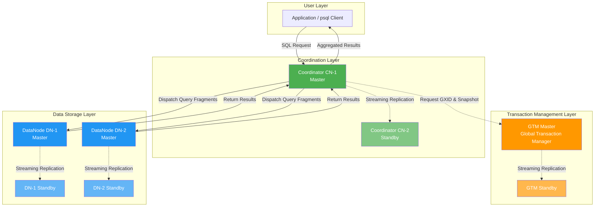

# OpenTenBase Architecture Glossary & Newcomer Guide

> This document is designed for developers new to OpenTenBase. It systematically covers core architectural terms and helps readers quickly build a holistic understanding through an architecture diagram and a "journey of a query" walkthrough.

## Table of Contents

- [1. Architecture Overview](#1-architecture-overview)
- [2. Core Glossary](#2-core-glossary)
- [3. Journey of a Query](#3-journey-of-a-query)
- [4. Data Distribution Strategies](#4-data-distribution-strategies)
- [5. Distributed vs. Centralized Mode](#5-distributed-vs-centralized-mode)
- [6. FAQ](#6-faq)
- [7. Quick Start Tips](#7-quick-start-tips)

---

## 1. Architecture Overview

OpenTenBase is an enterprise-grade distributed HTAP database evolved from the Postgres-XL project. A complete distributed cluster consists of three types of nodes working together:



**Responsibilities of the three node types:**

| Node Type | Role | Stored Data | Quantity |
|-----------|------|-------------|----------|
| **Coordinator (CN)** | Cluster "front desk" | Metadata only (table schemas, node mappings, etc.) | One or more |
| **DataNode (DN)** | Cluster "warehouse" | All user data | Two or more |
| **GTM** | Cluster "notary office" | Global transaction IDs and snapshot info | One master (with optional standby) |

> **Source:** README Overview — "An OpenTenBase cluster consists of multiple CoordinateNodes, DataNodes, and GTM nodes. All user data resides in the DataNodes, the CoordinateNode contains only metadata, the GTM is for global transaction management."

---

## 2. Core Glossary

The following 15 core terms are organized in learning order:

| # | Term | Explanation | Source |
|---|------|-------------|--------|
| 1 | **Coordinator (CN)** | The cluster's entry point. Users always connect to CN, never directly to DN. CN receives SQL, parses and optimizes it, splits the query into parallelizable fragments dispatched to DNs, and finally aggregates and returns results. CN stores only metadata, no user data. | README Overview |
| 2 | **DataNode (DN)** | The cluster's data warehouse. All user data is distributed across DNs. DNs execute query fragments in parallel. Each DN can be configured with master-slave replication for high availability. | README Overview |
| 3 | **GTM (Global Transaction Manager)** | The cluster's notary office. It assigns a globally unique transaction ID (GXID) and a global snapshot to each transaction, ensuring that distributed transactions across multiple DNs satisfy ACID properties like single-node transactions. | README Overview |
| 4 | **Distributed Mode** | A deployment mode with GTM + CN + DN all present. Data is sharded across multiple DNs, supporting horizontal scaling and parallel computing. Suitable for large data volumes and high throughput. | README config.ini field spec |
| 5 | **Centralized Mode** | A deployment mode with only DN (including master-slave), without GTM and CN. Suitable for moderate data volume requiring high availability. Behaves like a traditional PostgreSQL master-slave setup. | README config.ini field spec |
| 6 | **Shard Key** | The column specified with `distribute by shard(column)`. The system computes a hash on this column's value to determine which DN stores each row. The shard key's value, type, and length cannot be modified. | Official docs "Basic Use" |
| 7 | **Data Distribution Strategy** | The data storage method specified at table creation. OpenTenBase supports SHARD (hash sharding), REPLICATION (full copy on all nodes), ROUNDROBIN (round-robin distribution), etc. The default is SHARD. | Official docs "Basic Use" |
| 8 | **Node Group** | A logical grouping of DNs. Specified via `to group xxx`, it enables physical data isolation between different business domains. Each cluster has a default `default_group`, and users can create custom groups. | Official docs + README_ZH |
| 9 | **Sharded Table** | A table whose data is hash-distributed across DNs by a shard key. The most common table type in distributed scenarios, suitable for large datasets with queries that include the shard key. | Official docs "Basic Use" |
| 10 | **Replicated Table** | A table with a complete copy of data on every DN. Suitable for small, infrequently updated dimension tables used in cross-node JOINs. Writes must sync to all DNs, so write performance is lower. | Official docs "Basic Use" |
| 11 | **Master-Slave Replication** | CN, DN, and GTM all support master-slave architecture. The master handles read/write requests and replicates data to standby nodes via PostgreSQL streaming replication. If the master fails, a standby can be promoted, ensuring high availability. | README config.ini master/slave fields |
| 12 | **Shared-Nothing Architecture** | Each DN node independently owns its CPU, memory, and storage — nodes do not share resources. Adding machines linearly scales computing power and storage capacity, forming the foundation of horizontal scaling in distributed databases. | Postgres-XL architecture inheritance |
| 13 | **opentenbase_ctl** | The officially recommended cluster operations and management tool. Supports cluster installation, start/stop, status monitoring, and master-slave failover. Uses `opentenbase_config.ini` to describe cluster topology. Source code located at `contrib/opentenbase_ctl/`. | README Installation + contrib dir |
| 14 | **opentenbase_config.ini** | The core configuration file for cluster deployment. Defines instance name, deployment mode (distributed/centralized), node IPs, SSH credentials, etc. A template can be auto-generated by the `opentenbase_ctl` command. | README Installation |
| 15 | **HTAP** | Hybrid Transactional/Analytical Processing. OpenTenBase simultaneously supports high-concurrency OLTP transaction processing and large-scale OLAP analytical queries, eliminating the need to shuttle data between separate systems. | Official docs homepage |

> **Note:** Earlier versions used the `pgxc_ctl` tool and `pgxc_ctl.conf` configuration file (inherited from Postgres-XL), with source code still preserved at `contrib/pgxc_ctl/`. The new version recommends `opentenbase_ctl` and `opentenbase_config.ini`, which offer more complete features and support centralized mode deployment.

---

## 3. Journey of a Query

The following uses a `SELECT` query to illustrate the complete flow from user initiation to result return:

| Step | Phase | Executing Node | Action |
|------|-------|---------------|--------|
| 1 | Connection | CN | User connects to the CN master node via `psql` or an application driver; CN receives the SQL statement |
| 2 | Transaction Init | CN → GTM | CN requests a global transaction ID (GXID) and global snapshot from GTM; GTM returns them and CN attaches them to the query |
| 3 | Parse & Optimize | CN | CN performs syntax parsing, semantic analysis, and generates an execution plan, determining which DNs to access |
| 4 | Dispatch & Execute | CN → DN | CN splits the query into fragments and routes them to target DNs based on the shard key; DNs execute fragments in parallel |
| 5 | Aggregate & Return | DN → CN → User | DNs return partial results to CN; CN merges, sorts, and aggregates them, then returns the final result to the user |

> **Tip:** If the query condition includes the shard key, CN can route precisely to a single DN (Step 4 involves only one node), achieving optimal performance. Without the shard key, the query is broadcast to all DNs (Step 4 involves all nodes), and CN must aggregate the results.

> **Source:** README Overview — "Users always connect to the CoordinateNodes, which divide up the query into fragments that are executed in the DataNodes, and collect the results."

---

## 4. Data Distribution Strategies

| Strategy | Syntax | Distribution Method | Use Case | Notes |
|----------|--------|-------------------|----------|-------|
| **SHARD** | `distribute by shard(col)` | Hash by shard key to DNs | Large data, queries with shard key | Shard key immutable |
| **REPLICATION** | `distribute by replication` | Full copy on each DN | Small dimension tables, frequent JOINs | High write overhead for large data |
| **ROUNDROBIN** | `distribute by roundrobin` | Round-robin to DNs | Log tables without natural shard key | No key-based routing |
| **Single Table** | `to group single_group` | Stored on one DN only | Small, frequently updated, no JOINs | Requires a dedicated node group |

Table creation examples:

```sql
-- Sharded table (most common)
CREATE TABLE orders (
    id   BIGINT NOT NULL,
    uid  BIGINT NOT NULL,
    amount NUMERIC(10,2),
    PRIMARY KEY (id)
) DISTRIBUTE BY SHARD(id) TO GROUP default_group;

-- Replicated table (dimension table)
CREATE TABLE region_dict (
    region_id INT NOT NULL,
    region_name VARCHAR(50),
    PRIMARY KEY (region_id)
) DISTRIBUTE BY REPLICATION TO GROUP default_group;
```

> **Source:** Official docs "Basic Use" page — creation syntax and constraints for shard tables, replicated tables, and single tables.

---

## 5. Distributed vs. Centralized Mode

| Dimension | Distributed Mode | Centralized Mode |
|-----------|-----------------|-----------------|
| Node composition | GTM + CN + DN | DN only (with master-slave) |
| Data storage | Sharded across multiple DNs | Single DN |
| Horizontal scaling | Supported, add DNs to scale | Not supported |
| Global transactions | Coordinated by GTM | Local transactions on single node |
| Use case | Large data, high concurrency, scaling | Moderate data, high availability, no sharding |
| Configuration complexity | Higher | Lower |

Specified via `type=distributed` or `type=centralized` in `opentenbase_config.ini`.

Distributed mode configuration includes `[gtm]`, `[coordinators]`, and `[datanodes]` sections; centralized mode includes only the `[datanodes]` section and ignores GTM and coordinator configuration.

> **Source:** README opentenbase_config.ini field spec — "distributed represents distributed mode, requires gtm, coordinator and data nodes; centralized represents centralized mode".

---

## 6. FAQ

### Q1: Which node should I connect to for executing SQL?

**Always connect to the Coordinator (CN) master node.** CN is the sole entry point, responsible for SQL parsing, query dispatch, and result aggregation. Connecting to a DN cannot execute distributed queries. Use `opentenbase_ctl status` to find the Master CN connection address and port.

> **Source:** README Usage section — "Connect to CN Master node to execute SQL".

### Q2: Where is data stored? Does CN store user data?

**All user data is stored on DataNodes (DNs).** CN stores only metadata (table schemas, sharding rules, node mappings). This is a core characteristic of the Shared-Nothing architecture — compute and storage are separated; CN focuses on coordination, DN focuses on storage.

> **Source:** README Overview — "All user data resides in the DataNodes, the CoordinateNode contains only metadata".

### Q3: How to choose between distributed and centralized mode?

- **Data exceeds single-machine capacity** or horizontal scaling is needed → Distributed mode
- **Moderate data volume** but high availability is required → Centralized mode
- Centralized mode is simpler to deploy and can be migrated to distributed mode later

### Q4: Why is GTM needed? Will it become a bottleneck?

GTM assigns global transaction IDs and snapshots, guaranteeing distributed transaction consistency. In OpenTenBase, GTM handles only lightweight transaction metadata (IDs and snapshots), not data reads/writes, so overhead is minimal. GTM also supports master-slave high availability to avoid single-point failure.

> **Source:** README Overview — "the GTM is for global transaction management".

### Q5: What happens if I don't specify a distribution strategy when creating a table?

The system automatically selects the default SHARD strategy and chooses a shard key by priority:
1. Has primary key → first column of primary key
2. Has unique index → first column of unique index
3. No constraints → first column of the table

While the default rules work in most cases, explicitly specifying a shard key based on your query patterns is recommended for optimal performance.

> **Source:** Official docs "Basic Use" — "If there is a primary key, the primary key is selected as the shard key. If the primary key is a composite field, the first field is selected".

---

## 7. Quick Start Tips

1. **Read the README**: Understand cluster composition and build/installation
2. **Deploy with opentenbase_ctl**: Run `prepare config` to generate a template, fill in node info, execute `opentenbase_ctl install -c opentenbase_config.ini` for one-click installation
3. **Connect to CN for SQL**: Use `psql -h <CN_IP> -p <CN_PORT> -U opentenbase -d postgres`
4. **Create sharded tables**: Choose an appropriate shard key and distribution strategy
5. **Refer to official docs**: [https://docs.opentenbase.org/](https://docs.opentenbase.org/) for the full guide

> **Source:** README Installation section — opentenbase_ctl tool usage flow.

---

> This document is continuously updated with OpenTenBase releases. For questions, please open an issue on [GitHub](https://github.com/OpenTenBase/OpenTenBase/issues).
