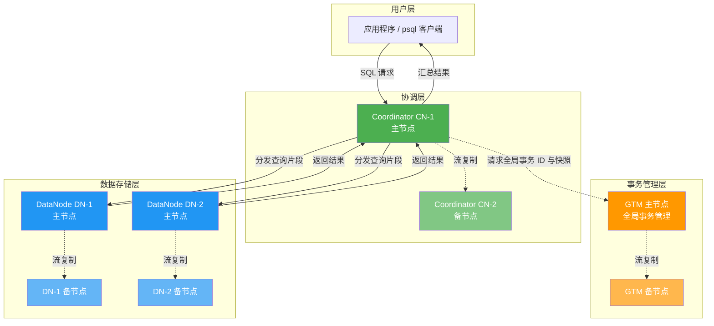

# OpenTenBase 架构术语表与新手导览

> 本文档面向初次接触 OpenTenBase 的开发者，系统梳理核心架构术语，并通过架构图和"一条查询的旅程"帮助读者快速建立整体认知。

## 目录

- [一、架构总览](#一架构总览)
- [二、核心术语表](#二核心术语表)
- [三、一条查询的旅程](#三一条查询的旅程)
- [四、数据分布策略详解](#四数据分布策略详解)
- [五、分布式 vs 集中式模式](#五分布式-vs-集中式模式)
- [六、常见问题（FAQ）](#六常见问题faq)
- [七、快速上手建议](#七快速上手建议)

---

## 一、架构总览

OpenTenBase 是基于 Postgres-XL 演进而来的企业级分布式 HTAP 数据库。一个完整的分布式集群由三类节点协同工作：



**三类节点的职责划分：**

| 节点类型 | 角色 | 存储内容 | 数量 |
|---------|------|---------|------|
| **Coordinator (CN)** | 集群的"前台" | 仅元数据（表结构、节点映射等） | 一个或多个 |
| **DataNode (DN)** | 集群的"仓库" | 全部用户数据 | 两个或多个 |
| **GTM** | 集群的"公证处" | 全局事务 ID 和快照信息 | 一个主节点（可配备节点） |

> **来源：** README Overview — "An OpenTenBase cluster consists of multiple CoordinateNodes, DataNodes, and GTM nodes. All user data resides in the DataNodes, the CoordinateNode contains only metadata, the GTM is for global transaction management."

---

## 二、核心术语表

以下整理了 15 个核心术语，按认知顺序排列：

| 序号 | 术语 | 英文 | 简明解释 | 验证来源 |
|-----|------|------|---------|---------|
| 1 | 协调节点 | Coordinator (CN) | 集群入口。用户始终连接 CN 而非 DN。它接收 SQL、解析优化、将查询拆分为片段下发到各 DN 并行执行，最后汇总返回。CN 只存元数据，不存用户数据。 | README Overview |
| 2 | 数据节点 | DataNode (DN) | 集群的数据仓库。所有用户数据分布在各 DN 上，DN 并行执行 CN 下发的查询片段。每个 DN 可配主从，通过流复制实现高可用。 | README Overview |
| 3 | 全局事务管理器 | GTM (Global Transaction Manager) | 集群的公证处。为每个事务分配全局唯一事务 ID（GXID）和全局快照，确保跨多个 DN 的分布式事务像单机一样满足 ACID。 | README Overview |
| 4 | 分布式模式 | Distributed Mode | GTM + CN + DN 齐全的部署模式。数据按分片策略分布在多个 DN 上，支持横向扩展和并行计算，适合大数据量、高吞吐场景。 | README config.ini 字段说明 |
| 5 | 集中式模式 | Centralized Mode | 仅部署 DN（含主从），不部署 GTM 和 CN。适合数据量不大但需高可用的场景，行为类似传统 PostgreSQL 主从架构。 | README config.ini 字段说明 |
| 6 | 分片键 | Shard Key | 用 `distribute by shard(字段)` 指定的字段。系统按该字段值计算哈希，决定数据行存储在哪个 DN 上。其值、类型和长度均不可修改。 | 官方文档"基本使用" |
| 7 | 数据分布策略 | Data Distribution Strategy | 建表时指定的数据存储方式。支持 SHARD（哈希分片）、REPLICATION（全量复制）、ROUNDROBIN（轮询）等，默认为 SHARD。 | 官方文档"基本使用" |
| 8 | 节点组 | Node Group | DN 的逻辑分组。通过 `to group xxx` 指定，实现不同业务的数据物理隔离。每个集群默认包含 `default_group`。 | 官方文档"基本使用" + README_ZH |
| 9 | 分片表 | Sharded Table | 数据按分片键哈希后分散存储在各 DN 上的表。分布式场景下最常用的表类型，适合数据量大且查询可带分片键的场景。 | 官方文档"基本使用" |
| 10 | 复制表 | Replicated Table | 每个 DN 上都存有完整数据的表。适合数据量小、更新频率低、常用于跨库 JOIN 的维度表。写入时需同步所有 DN，性能较低。 | 官方文档"基本使用" |
| 11 | 主从复制 | Master-Slave Replication | CN、DN、GTM 均支持主从架构。主节点处理读写，通过 PostgreSQL 流复制将数据同步到备节点，主故障时备可提升为主，保障高可用。 | README config.ini master/slave 字段 |
| 12 | Shared-Nothing 架构 | Shared-Nothing Architecture | 各 DN 独立拥有 CPU、内存和存储，节点间不共享资源。新增机器即可线性扩展算力和存储，是分布式数据库横向扩展的基础。 | Postgres-XL 架构继承 |
| 13 | opentenbase_ctl | — | 官方推荐的集群运维工具。支持安装、启停、状态查看、主备切换，通过 `opentenbase_config.ini` 描述集群拓扑。源码位于 `contrib/opentenbase_ctl/`。 | README 安装章节 + contrib 目录 |
| 14 | opentenbase_config.ini | — | 集群部署核心配置文件。定义实例名称、部署模式（distributed/centralized）、各节点 IP、SSH 信息等。可由 `opentenbase_ctl` 自动生成模板。 | README 安装章节 |
| 15 | HTAP | Hybrid Transactional/Analytical Processing | 混合事务分析处理。OpenTenBase 同时支持高并发 OLTP 事务处理和大规模 OLAP 分析查询，无需在两套系统间搬运数据。 | 官方文档站首页 |

> **补充说明：** 早期版本使用 `pgxc_ctl` 工具和 `pgxc_ctl.conf` 配置文件（继承自 Postgres-XL），源码仍保留在 `contrib/pgxc_ctl/`。新版本推荐使用 `opentenbase_ctl` 和 `opentenbase_config.ini`，功能更完善，支持集中式模式部署。

---

## 三、一条查询的旅程

以下以一条 `SELECT` 查询为例，展示 SQL 从用户发起到结果返回的完整流程：

| 步骤 | 阶段 | 执行节点 | 具体动作 |
|-----|------|---------|---------|
| 1 | 连接接入 | CN | 用户通过 `psql` 或应用驱动连接 CN 主节点，CN 接收 SQL 语句 |
| 2 | 事务初始化 | CN → GTM | CN 向 GTM 请求全局事务 ID（GXID）和全局快照，GTM 返回后 CN 将其附加到本次查询 |
| 3 | 查询解析与优化 | CN | CN 对 SQL 进行语法解析、语义分析、生成执行计划，确定需要访问哪些 DN |
| 4 | 查询下发与并行执行 | CN → DN | CN 将查询拆分为片段，根据分片键路由到目标 DN；各 DN 并行执行查询片段 |
| 5 | 结果汇总与返回 | DN → CN → 用户 | 各 DN 将局部结果返回 CN，CN 进行合并、排序、聚合等操作，将最终结果返回给用户 |

> **提示：** 如果查询条件包含分片键，CN 可以精准路由到单个 DN（步骤 4 只涉及一个节点），性能最优；如果不含分片键，则需广播到所有 DN 执行（步骤 4 涉及全部节点），再由 CN 汇总。

> **来源：** README Overview — "Users always connect to the CoordinateNodes, which divide up the query into fragments that are executed in the DataNodes, and collect the results."

---

## 四、数据分布策略详解

| 策略 | 语法 | 数据分布方式 | 适用场景 | 注意事项 |
|------|------|------------|---------|---------|
| **SHARD** | `distribute by shard(col)` | 按分片键哈希分散到各 DN | 数据量大，查询常带分片键 | 分片键不可更新、不可改类型 |
| **REPLICATION** | `distribute by replication` | 每个 DN 存全量数据 | 小表、维度表、频繁跨库 JOIN | 数据量大时写入开销高 |
| **ROUNDROBIN** | `distribute by roundrobin` | 轮询分配到各 DN | 无明显分片键的日志表 | 不支持按键精准路由 |
| **单表** | `to group single_group` | 仅存在一个 DN 上 | 数据量小、更新频繁、无需 JOIN | 需创建独立节点组实现 |

建表示例：

```sql
-- 分片表（最常用）
CREATE TABLE orders (
    id   BIGINT NOT NULL,
    uid  BIGINT NOT NULL,
    amount NUMERIC(10,2),
    PRIMARY KEY (id)
) DISTRIBUTE BY SHARD(id) TO GROUP default_group;

-- 复制表（维度表）
CREATE TABLE region_dict (
    region_id INT NOT NULL,
    region_name VARCHAR(50),
    PRIMARY KEY (region_id)
) DISTRIBUTE BY REPLICATION TO GROUP default_group;
```

> **来源：** 官方文档"基本使用"页面，shard 表/复制表/单表的创建语法和约束说明。

---

## 五、分布式 vs 集中式模式

| 对比维度 | 分布式模式 (distributed) | 集中式模式 (centralized) |
|---------|------------------------|------------------------|
| 节点组成 | GTM + CN + DN | 仅 DN（含主从） |
| 数据存储 | 数据分片分布在多个 DN | 数据存储在单个 DN |
| 横向扩展 | 支持，加 DN 即可扩容 | 不支持 |
| 全局事务 | 由 GTM 协调跨节点事务 | 单节点本地事务 |
| 适用场景 | 大数据量、高并发、需扩展 | 数据量适中、高可用、无需分片 |
| 配置复杂度 | 较高 | 较低 |

在 `opentenbase_config.ini` 中通过 `type=distributed` 或 `type=centralized` 指定。

分布式模式配置包含 `[gtm]`、`[coordinators]`、`[datanodes]` 三个节点段；集中式模式仅包含 `[datanodes]` 段，会忽略 GTM 和协调节点的配置。

> **来源：** README 中 opentenbase_config.ini 字段说明 — "distributed represents distributed mode, requires gtm, coordinator and data nodes; centralized represents centralized mode"。

---

## 六、常见问题（FAQ）

### Q1：我应该连接哪个节点执行 SQL？

**始终连接 Coordinator (CN) 主节点。** CN 是集群的唯一入口，负责 SQL 解析、查询分发和结果汇总。连接 DN 无法执行分布式查询。连接信息可通过 `opentenbase_ctl status` 命令查看 Master CN 的连接地址和端口。

> **来源：** README Usage 章节 — "Connect to CN Master node to execute SQL"。

### Q2：数据存在哪里？CN 会不会存储用户数据？

**所有用户数据存储在 DataNode (DN) 上。** CN 只存储元数据（表结构、分片规则、节点映射等），不存储任何用户业务数据。这是 Shared-Nothing 架构的核心特征——计算与存储分离，CN 专注协调，DN 专注存储。

> **来源：** README Overview — "All user data resides in the DataNodes, the CoordinateNode contains only metadata"。

### Q3：分布式模式和集中式模式怎么选？

- **数据量超过单机容量**，或需要水平扩展 → 选择分布式模式
- **数据量适中**，但需要主从高可用 → 选择集中式模式
- 集中式模式部署更简单，后续如需扩展可迁移到分布式模式

### Q4：为什么需要 GTM？它会不会成为瓶颈？

GTM 负责分配全局事务 ID 和快照，是分布式事务一致性的保障。在 OpenTenBase 中，GTM 只处理轻量级的事务元信息（ID 和快照），不参与数据读写，因此开销很小。同时 GTM 支持主从高可用，避免单点故障。

> **来源：** README Overview — "the GTM is for global transaction management"。

### Q5：建表时不指定分布方式会怎样？

系统会自动选择默认的 SHARD 策略，并按以下优先级自动选择分片键：
1. 有主键 → 选主键第一个字段
2. 有唯一索引 → 选唯一索引第一个字段
3. 无上述约束 → 选表的第一个字段

虽然默认规则在大多数场景下可用，但建议根据业务查询模式显式指定分片键，以获得最佳性能。

> **来源：** 官方文档"基本使用"页面 — "有主键，则选择主键做分片键。如果主键是复合字段组合，则选择第一个字段做分片键"。

---

## 七、快速上手建议

1. **阅读 README**：了解集群组成和编译安装流程
2. **使用 opentenbase_ctl 部署**：运行 `prepare config` 生成配置模板，填写节点信息，执行 `opentenbase_ctl install -c opentenbase_config.ini` 一键安装
3. **连接 CN 执行 SQL**：通过 `psql -h <CN_IP> -p <CN_PORT> -U opentenbase -d postgres` 连接
4. **创建分片表**：根据业务选择合适的分片键和分布策略
5. **参考官方文档**：[https://docs.opentenbase.org/](https://docs.opentenbase.org/) 获取完整使用指南

> **来源：** README Installation 章节 — opentenbase_ctl 工具的使用流程。

---

> 本文档随 OpenTenBase 版本迭代持续更新，如有疑问欢迎在 [GitHub Issues](https://github.com/OpenTenBase/OpenTenBase/issues) 中反馈。
